# Instalación de servidores: ***Ubuntu Server*** y ***centOS*** {#p1}

## Objetivos de la práctica

Objetivos mínimos:

1. Familiarizarse con distintos Sistemas Operativos (SOs) usados en servidores.
2. Conocer alternativas comerciales para tener un servidor.
3. Configurar unidades de disco RAID y LVM.
4. Configurar una red local de máquinas virtuales.


## Sesión 1: Instalación de Ubuntu Server y centOS

### Conceptos básicos


Repasamos los siguientes conceptos básicos que conviene conocer antes de iniciar las tareas de esta sesión:

1. Servidor, como un sistema informático que recibe peticiones y da respuestas a las mismas.
2. Tecnología de servidores, distinguiendo: 
    a. ***Hosting*** dedicado:es una configuración de alojamiento en el que se dedica un servidor a una sola organización o para un solo propósito, como una página web. No escalable.
    b. ***VPS*** (Virtual Private Server), donde varias MV comparten una serie de recursos hardware (Disco Duro, RAM, CPU, …).
    c. ***Serverless*** (servicios en la nube), las aplicaciones montan ahí sus recursos y todas las tareas de administración de sistema están abstraídas para el usuario hasta el punto que él no tiene que preocuparse de las mismas. Es el modelo más actual por su alta capacidad de escalabilidad.
    
3. Una tecnología de servidores basada en contenedores se caracteriza porque cada uno de estos contenedores se interpreta como una MV, sólo que cada una de esas MV son aplicaciones sobre el SO anfitrión, en tanto en cuanto:
    - Los contenedores están (pueden estar) interconectados entre sí,
    - Puedo añadir nuevos contenedores dinámicamente e ir conectándolos a otros que estén en activo (arrancados, funcionando).
    
    Un ejemplo es un servidor web donde un contenedor C1 contiene el motor web, otro C2 contiene la base de datos y el C3, que contendría el intérprete de peticiones web.

4. La tecnología *RAID* surge como solución a la problemática del precio del almacenamiento. Las siglas se refieren a ***Redundant Array of Independent Disks*** (Almacén Redundante de Discos Independientes). Existen diversos tipos de tecnologías RAID, las más importantes son RAID-0 y RAID-1:
    a. *RAID-0*. Un RAID-0 distribuye los datos equitativamente entre dos o más discos (usualmente se ocupa el mismo espacio en dos o más discos) sin información de paridad que proporcione redundancia. Es importante señalar que el RAID 0 no es redundante. Un RAID 0 puede ser creado con discos de diferentes tamaños, pero el espacio de almacenamiento añadido al conjunto estará limitado por el tamaño del disco más pequeño (por ejemplo, si se hace un conjunto dividido con un disco de 450 GB y otro de 100 GB, el tamaño del conjunto resultante será sólo de 200 GB, ya que cada disco aporta 100 GB).
    b. Un RAID 1 crea una copia exacta (o espejo) de un conjunto de datos en dos o más discos. Esto resulta útil cuando queremos tener más seguridad desaprovechando capacidad, ya que si perdemos un disco, tenemos el otro con la misma información. Un conjunto RAID 1 sólo puede ser tan grande como el más pequeño de sus discos. Un RAID 1 clásico consiste en dos discos en espejo, lo que incrementa exponencialmente la fiabilidad respecto a un solo disco; es decir, que para que el conjunto falle es necesario que lo hagan todos sus discos.
    c. **Ejercicio** Busca información sobre los tipos de RAID siguientes: RAID-10, RAID-5 y RAID-6.
    
```{r rmarkdown, echo=FALSE, out.width='90%', fig.align='center', fig.cap='Configuración de RAID-0. Elaboración propia.'}
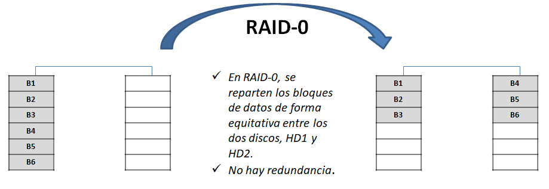
```

5. Sistema de archivos 
    a. Sistema de archivos *ext2*: principales características:
        - No admite Journaling
        - Adecuado para tarjetas SD y unidades USB, ya que tiene un alto rendimiento y escritura baja (ya que el registro en diario no está disponible). USB y almacenamiento SD están limitados con ciclos de escritura por lo tanto su mejor ajuste para ellos.
        - Límites: Tamaño de archivo individual de 16 GB a 2 TB. 
        - Tamaño del sistema de archivos de 2TB a 32TB.
    b. Sistema de archivos ext4
        - Soporta Journaling
        - Muchas de las nuevas características introducidas. Extents, Compatibilidad con versiones anteriores, Pre-asignación persistente, Asignación diferida, Número ilimitado de subdirectorios, Suma de comprobación del diario, Comprobación FS más rápida, Encriptación transparente.
        - Límites: Tamaño de archivo individual de 16GB a 16TB. Tamaño del sistema de archivos hasta 1EB.
        - No es necesario actualizar el sistema de archivos. Debido a la compatibilidad hacia atrás, ext2, ext3 se puede montar directamente como ext4.
        
### Proceso de instalación de Ubuntu Server 16.04

## Sesión 2: Ampliación de capacidad para un usuario en el servidor ***centOS***.

En este caso, la idea es que, una vez instalado el servidor de centOS en el disco por defecto que nos crea VirtualBox, añadamos más capacidad a la “carpeta” de ese usuario concreto.

Para estas operaciones habrá que tener en cuenta algunas consideraciones y delicadezas de centOS con respecto a Ubuntu. Pero ya las iremos viendo…

### Contextualización del escenario profesional

El escenario profesional es el siguiente: En esta ocasión, en la empresa en la que le acaban de contratar tenían adquirido un servidor y su predecesor había realizado la instalación del S.O. CentOS, según le han comentado los compañeros, él solía hacer instalaciones por defecto y luego aplicar scripts de configuración. Sin más información, nuestro jefe nos informa que esa máquina va a alojar unos cursos con vídeos de alta calidad y relativamente largos. Por tanto, viendo la configuración del sistema, prevemos que /var necesitará más espacio, incluso es conveniente asignarle un LV exclusivamente. Para ello, incluiremos un nuevo disco y configuraremos LVM para que /var se monte en el nuevo VL que crearemos para él.

### Pasos previos: instalación de ***centOS***

> Recuerda que al instalar centOS hay que crear el usuario con su clave y darle permisos de administrador. Además tienes que establecer contraseña de root para poder hacer todo lo siguiente.

### Procedimiento

Pasos a realizar: 

1. Una vez hecha la instalación por defecto, y al iniciar sesión en el servidor, se nos proporciona el siguiente *sistema de particiones* sobre el único disco que tenemos, de 8 GB, que le habíamos proporcionado (ver figura \@ref(fig:a)). 


```{r a, echo=FALSE, out.width='60%', fig.align='center', fig.cap='Situación de particionado del primer disco tras instalar centOS con las opciones por defecto.'}
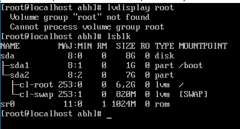
```


Es decir, que el volumen físico `sda2`tiene 7GB y en él se ubica el VG llamado `cl`, donde están los volúmenes lógicos `root` (de 6,2 GB) y `swap` (de 820 MB). 

2. Añadamos el nuevo disco y configurémoslo  para que `/var` tenga ese espacio extra (todo esto tiene detrás un proceso relativamente corto que iremos viendo). 

Por ahora, apagamos el ordenador (comando `poweroff`), añadimos el nuevo disco a nuestra Máquina Virtual y arrancamos. La situación tras añadir  el nuevo disco "físico" y hacer `lsblk` es se ve en la figura \@ref(fig:b).


```{r b, echo=FALSE, out.width='60%', fig.align='center', fig.cap='Situación tras aña'}
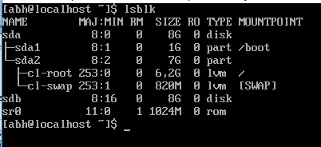
```


3. Como vemos, aparece el disco `sdb`, que es el nuevo disco que hemos añadido, pero vemos que no tiene ningún PV (volumen físico) asociado, con lo cual es como si ese espacio lo tuviéramos inútil al completo. Comprobémoslo con la(s) orden(es) de LVM que nos informa(n) de los volúmenes físicos existentes en nuestro sistema: `pvdisplay` o de forma resumida, `pvs` (ver figura \@ref(fig:c)).


```{r c, echo=FALSE, out.width='60%', fig.align='center', fig.cap='Mostrando los volúmenes físicos actuales. '}
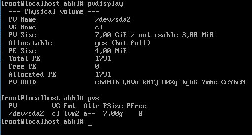
```


Y vemos que en efecto no refleja nada sobre el segundo disco creado. 

4. Lo primero que vamos a hacer es definir el volumen físico asociado a ese nuevo disco, para ello usaremos el comando `pvcreate` (ver figura \@ref(fig:d)).


```{r d, echo=FALSE, out.width='70%', fig.align='center', fig.cap='Creación del nuevo volumen físico `sdb` y comprobación de que se ha creado con la orden `pvs`.'}
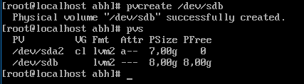
```


5. Ahora hay que extender el Grupo de Volúmenes (VG) llamado `cl` con este nuevo volumen físico (recordemos la jerarquía de particiones y nomenclatura que establecía LVM) mediante la orden `vgextend`, y comprobamos que lo hemos hecho bien en la figura \@ref(fig:e). 


```{r e, echo=FALSE, out.width='70%', fig.align='center', fig.cap='Extendiendo el grupo de volúmenes `cl` y comprobando que lo hemos hecho bien con el comando `vgs`.'}
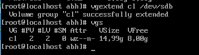
```


 Y vemos que ya el campo `#PV` aparece con el valor `2`. 

6. Ahora vamos a **crear el nuevo volumen lógico** donde almacenar los datos que queremos, y que montaremos en `/var` (ver figura \@ref(fig:f)):


```{r f, echo=FALSE, out.width='90%', fig.align='center', fig.cap='Creación del volumen lógico con la orden `lvcreate`.'}
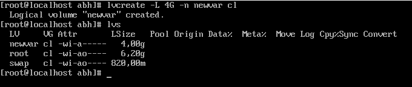
```

   Y queda comprobado que se ha creado bien. 

7. Ahora vamos a asignarle un **sistema de ficheros** mediante el comando `mkfs` con la opción `–t` para indicarle el tipo de Sistema de Archivos que le vamos a dar (en este caso, *ext4*), tal y como se muestra en la figura \@ref(fig:g).


```{r g, echo=FALSE, out.width='80%', fig.align='center', fig.cap='Asignando un sistema de archivos al nuevo volumen lógico.'}
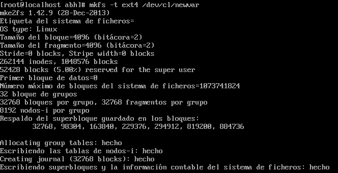
```


8. A continuación, tenemos que **montar el volumen lógico `newvar` para que esté accesible**^[Una analogía para recordar por qué montar un volumen: cuando conectamos una unidad de almacenamiento o un lector de DVD, el sistema tiene que crearle lo que se denomina un punto de montaje para poderlo utilizar. Este punto de montaje en casos de discos duros y pendrive’s, suele ser una carpeta que creamos manualmente en el sistema o nos lo crea él mismo automáticamente en una partición denominada `/media` en distribuciones basadas en Ubuntu. En nuestro caso, directamente las montamos sobre `/mnt/<dir_pto_montaje>`.] sobre un punto de montaje que vamos a crearnos y que se va a llamar `/mnt/newvar`:


```{shell}
mkdir /mnt/newvar	                        # crear carpeta aux. ` 
mount /dev/cl/newvar /mnt/newvar            # montar VL en aux.
```


9. Vamos a comprobar que el montaje ha sido satisfactorio. Para ello volvemos a ejecutar `mount` pero sin ninguna opción (o bien con `$ mount | grep var`, para que marque en color donde está `/var`), y en la última línea debería aparecer nuestro dispositivo newvar montado sobre `/mnt/newvar`, tal y como se muestra en la figura \@ref(fig:h).


```{r h, echo=FALSE, out.width='80%', fig.align='center', fig.cap='Fragmento (inicio y fin) de la orden `mount` tras montar newvar sobre el directorio auxiliar `/mnt/newvar` recién creado.'}
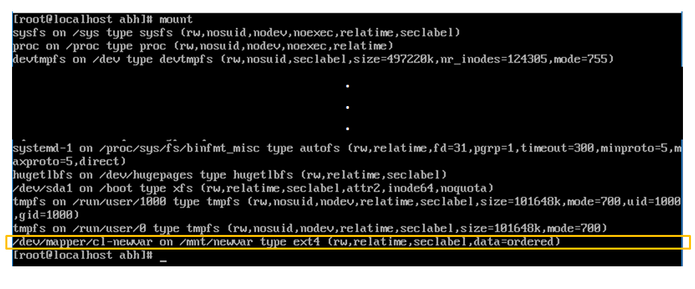
```

10. Ahora habría que copiar el contenido de /var, que es lo que queremos ampliar, en `/mnt/newvar`. Pero para evitar que otros usuarios hagan operaciones *r/w* mientras se hace esto, vamos a hacerlo de manera atómica, usando el modo **AISLADO**. Para ello, ejecutamos el comando `systemctl isolate runlevel1.target`, y tras autenticarnos (con usuario `root`) debe de aparecer lo mismo que en la figura \@ref(fig:i).


```{r i, echo=FALSE, out.width='80%', fig.align='center', fig.cap='Aspecto inicial del modo de mantenimiento (modo aislado).'}
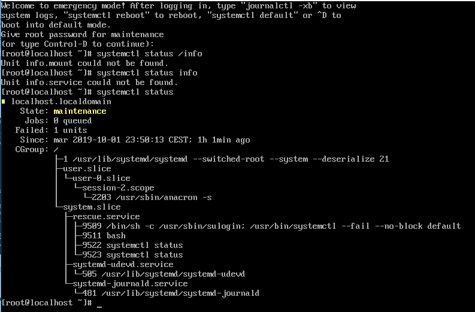
```


11. Ahora vamos a lo que queríamos hacer: copiar de `/var` a `/mnt/newvar`. Lo haremos (ver figura \@ref(fig:j)) con `cp`, obviamente, y con la opción `–a` (para corregir errores de contexto de SELinux) y seleccionando `/var/.` (el detalle es el punto tras el `/var`, que indica que *copie todo lo que haya, de manera recursiva y los ficheros ocultos incluidos*). Y lo comparamos con lo que hay en `/var` ejecutando: `> ls –lhaZ /var` y vemos que hay exactamente lo mismo, lo cual indica que hemos procedido correctamente.


```{r j, echo=FALSE, out.width='75%', fig.align='center', fig.cap='Paso importante: copiando todo el contenido de `/var` a `/mnt/newvar` y comprobación con `ls`.'}
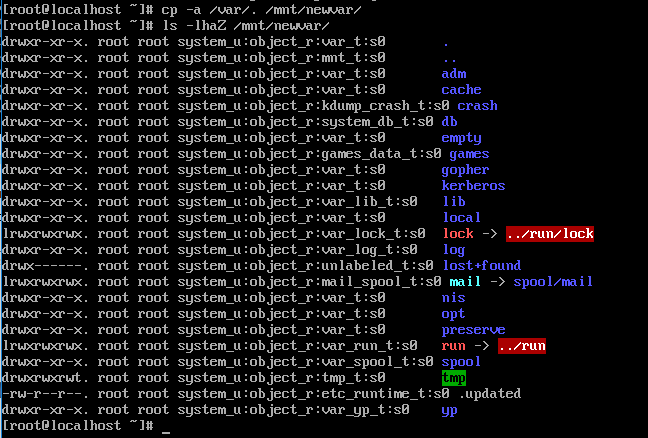
```


12. Ahora falta decirle al sistema lo más importante: que cada vez que arranque, monte el volumen lógico `newvar` en `/var`, para que dicho cliente pueda seguir accediendo a `/var` de manera transparente a dónde estén sus archivos. Este es un paso delicado donde hay que modificar un archivo del sistema, el `/etc/fstab`, que da información sobre el montaje de dispositivos y particiones al arranque del Sistema Operativo. Lo haremos con extremo cuidado, usando el editor `vi` y en modo **root**. 
i. abrir el fichero `/etc/fstab` con `vi` usando la orden:
    ```{shell}
    > vi /etc/fstab       # estando en modo root
    ```
ii. pulsamos la tecla `i` del teclado para acceder al modo de escritura,
iii. vamos al final del fichero, insertamos una nueva línea (nos colocamos **al final** de la última línea y pulsamos *Enter*),
iv. insertamos en la nueva línea el siguiente contenido:
```
/dev/cl/newvarTABULADOR/varTABULADORext4TABULADORdefaultsTABULADOR0TABULADOR0
```

donde la palabra `TABULADOR` indica que en ese lugar pulsemos la tecla de tabulador una sola vez.

v. tras repasar lo escrito y asegurarnos de que lo hemos escrito correctamente, pulsamos la tecla `Esc` para salir del modo de escritura y tecleamos en la línea de órdenes de la parte inferior de la pantalla que ofrece `vi` el literal `:wq` para guardar los cambios en el fichero (`w`) y salir (`q`).

El aspecto final de `/etc/fstab` será el de la figura \@ref(fig:k). 


```{r k, echo=FALSE, out.width='95%', fig.align='center', fig.cap='Estado final de `/etc/fstab` tras las modificaciones oportunas.'}
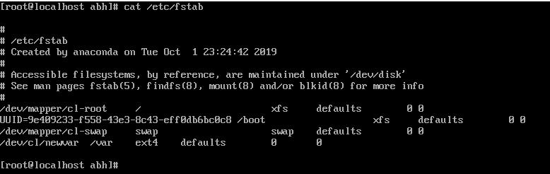
```

13. Ahora vamos a desmontar cosas para evitar errores:
    i. desmontar /mnt/newvar,
    ii. y es posible que haga falta: desmontar /dev/cl/newvar

Y ahora, mover `/var` a un directorio auxiliar llamado `/varold` (o el nombre que queramos) para evitar posibles errores. Ahora vamos a crear un nuevo `/var` mediante la orden `mkdir /var`, y le asignaremos un contexto a esa nueva carpeta con el comando de la figura \@ref(fig:l). 

14. Ahora ya está todo hecho, sólo falta reiniciar la máquina y comprobar con `ls –lhaZ` que tanto `/var` como `/varold` tienen exactamente el mismo contenido. 


```{r l, echo=FALSE, out.width='95%', fig.align='center', fig.cap='Restaurar el contexto del nuevo directorio `/var`, donde montaremos nuestro nuevo disco `/dev/cl/newvar`.'}
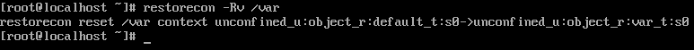
```

## Sesión 3: Ampliación cifrada y redundante de la capacidad para un usuario.

Este caso es una versión “mejorada” de la Sesión 2, pero hay que realizarla partiendo *desde cero*, es decir, tras haber instalado centOS únicamente.

>  RECUERDA que esta sesión se realizará sobre una máquina virtual sobre la que NO se haya implementado lo realizado en la Sesión 2. 

### Contextualización del escenario profesional

Tras ver el éxito de los vídeos alojados en el servidor configurado en la práctica anterior, un amigo de su cliente quiere proceder del mismo modo pero va a necesitar alojar información sensible así que le pide explícitamente que cifre la información y que ésta esté siempre disponible. Por tanto, la decisión que toma es configurar un RAID1 por software y cifrar el VL en el que /var estará alojado.

### ¿Qué necesitamos?

Aparte de lo mencionado antes sobre el Sistema Operativo y su estado, vamos a tener que crear dos discos extra, que serán los que conformen el RAID, uno de ellos tendrá el contenido exacto del otro (política de RAID1). 


### Pasos para la realización de la práctica

1. Partimos inicialmente del estado original de centOS (puede estar la red configurada, no hay problema con eso) de la figura \@ref(fig:1h).


```{r 1h, echo=FALSE, out.width='75%', fig.align='center', fig.cap='Estado inicial antes de crear el RAID-1.'}
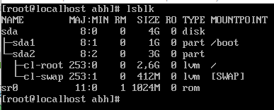
```


2. Entonces, vamos a apagar el sistema, añadimos los dos discos y reiniciamos. Lo que nos muestra ahora `lsblk` es lo siguiente (figura \@ref(fig:2h)):


```{r 2h, echo=FALSE, out.width='75%', fig.align='center', fig.cap='Comando `lsblk` tras crear dos discos vírgenes.'}
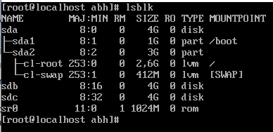
```


3. Ahora vamos a crear directamente el dispositivo RAID-1 a partir de los dos discos sdb y sdc mediante un comando que se llama mdadm (multimedia-admin). Para instalarlo, ejecutamos `> yum install mdadm`. El resultado de este proceso se muestra en la figura \@ref(fig:3h), y vemos que nos muestra un error. Este fallo es por un error de conexión a la red. Lo comprobamos ejecutando `ipaddr`, y vemos que la interfaz `enp0s3` (la que tenemos que mirar en nuestro caso para conectarnos a Internet) no tiene IP asignada. Hay que levantar la red mediante el comando `ifup enp0s3`; en la figura \@ref(fig:4h) vemos que ya se *levantado* correctamente. 

```{r 3h, echo=FALSE, out.width='90%', fig.align='center', fig.cap='Comando `lsblk` tras crear dos discos vírgenes.'}
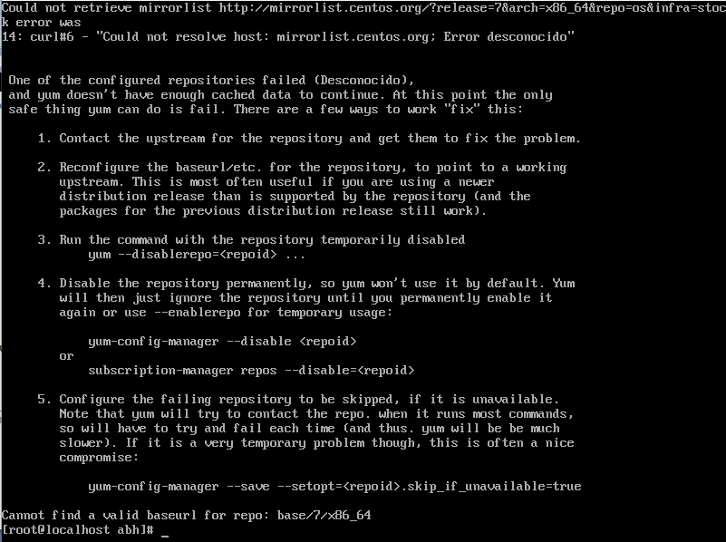
```

```{r 4h, echo=FALSE, out.width='95%', fig.align='center', fig.cap='Comando `lsblk` tras crear dos discos vírgenes.'}
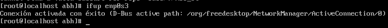
```

4. Tras conectarnos setisfactoriamente a Internet, ahora ya podremos instalar el gestor de RAID con el comando `> yum install mdadm`, decimos que sí a todo (opción `y`) y se instalará. 

5. **Creación del RAID-1**. Para crearlo correctamente y con las opciones que queramos habría que mirar el manual en línea de `mdadm`, y la orden definitiva se muestra en la figura \@ref(fig:5h).


